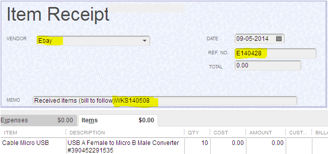

.. figure:: image/siger.jpg
   :height: 300px
   :width: 300 px
   :scale: 85 %
   :align: center

*************************************
G010-Receive Inventory Items
*************************************

.. topic:: Overview

   :Date: |today|
   :Author: **Corbin Fletcher**

.. contents:: 
   :depth: 2

+------------+------------+-----------+-----------+
| Document ID| Relase Date| Author    | Version   |
+============+============+===========+===========+
| G010-      | 19/1/2015  | Corbin    | v 1.0     |
| Receive    |            | Fletcher  |           |
| Inventory  |            |           |           | 
| Items      |            |           |           | 
+------------+------------+-----------+-----------+

.. versionadded:: v1.0, Content added 21/2/2015

Introduction
############
When merchandise arrives to our retail location each item must be received properly. During this process, you manually enter relevant data about each item received at our retail location. Initially, you are emailed a manifest, and then using the data contained in the manifest, you will enter data into our Quickbooks data base. This task is very important and you must be accurate when entering the data.

Scope   
#####
This task requires a team member to understand our daily operational process of documenting each sale as well as keeping track of petty cash. This SOP with provide the instruction need so any team member can follow the step by step instructions and complete the task.

Processes
##########
#. Log into Quickbooks;

#. Go to **Vendors => Receive Items**;

#. Next, the **Create Item Receipts** window will open;

    
.. note::
   Above is a detailed image of the Quickbooks Item Receipt window. Highlighted are the primary fields that need to be populated. Also, the image contains an example inventory item being received.

#. You must Enter each item into the Quickbooks database using the purchasing work sheet data.

#. After all the data has been entered, click on **Report => Transaction Journal** report;

#. Next, from the main tool bar, click **Excel => Create New Work Sheet**, Save the report to your local computer as an Excel spread sheet;

#. Then export the Excel file and save the report as PDF;

#. Next, navigate to your email client (MS Outlook), locate your originally email containing the purchase order work sheet, open the email and click reply to all. Next, compose an email, and send the PDF copy of your Transaction Journal report as an attachment;

#. Lastly, upload the PDF copy to SigerTronic System network share directory (**P:\Inventory Received**).

.. tip:: 
    You can use the note section of the COB sheet to state facts such as why you are short twenty dollars.

Scope
#####
Accurately enter received inventory items into our Qucikbooks database is an extremely crucial business process and it must be done correct. Anyone who is not experienced with this task should follow the processes articulated in this SOP. Additionally, this SOP will provide someone with all the information needed to complete this task.

Definitions
###########
.. container:: table-row
   
    *Receipt Book*: 
        For every sales transaction you will hand write a receipt. This receipt will serve as a secondary check when totaling your sales at the end of the day.
    
    *2 X 3 inch paper*: 
        You will need to keep sufficient quantity of two by three inch pieces of paper use for documenting each cash sale.
    
    *Cash Out Balance (COB) Sheet*: 
        This form is where you provide all details about your days sales.
    
    *Petty Cash*: 
        Is a term used to describe money that is separate from your daily deposit cash and petty cash is located to the right of the deposit money. The petty cash is also used to provide change to customers, if and only if, there is no money in the deposit cash stack. And you must make a note (e.g., PC $30) on your two by three inch paper reflecting the fact that you used money from petty cash to provide change.  The petty cash money is used to provide employees with money to make purchases of office supplies, gas of the motorcycles, etc. Petty cash amount should be three hundred dollars at all times.
    
    *Deposit Cash*: 
        is cash that is used daily to provide change for cash sales, and is provided to management at the end of the work day. 

Addational Information
######################
.. warning:: 
    This is an important section and it should not be over looked.  

* The amount of cash in the deposit stack must be equal or greater than the total from the cash column of the COB sheet. So, if the total cash amount from the cash column is $300 you should have $300 cash to provide for the deposit. However, if you have less money than the total from the cash column, you need to perform an investigation to determine why you are short. To begin your investigation you can check your collection of two by three inch papers and/or your receipt book to discover why there is a shortage. If you have a greater quantity of money in your deposit cash the amount that you are over is moved to petty cash.

* All currency is stored in the front desk area. There you will find two stacks of money, the stack furthest to the left is cash deposit money and the money to the right is petty cash. The cash deposit money is used to provide change when a customer has purchased an item. 

.. caution:: 
   SigerTronic Systems does **not** accept personal checks. 

