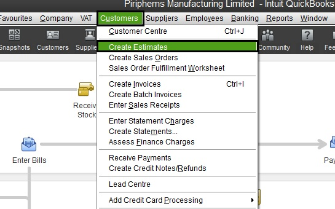

.. figure:: image/siger.jpg
   :height: 300px
   :width: 300px     
   :scale: 70 %
   :align: center
========================
G005-Prepare an Estimate 
========================
.. date::

.. cssclass:: table-bordered

+------------------------+------------+----------+----------+
| Ducument ID            | Release    | Author   | Version  |
|                        | Date       |          |          |
+========================+============+==========+==========+
| G005-Prepare an        | 01/07/2015 | Corbin   | v 1.0    | 
| Estimate               |            | Fletcher |          | 
|                        |            |          |          |  
+------------------------+------------+----------+----------+

Introduction
-------------
A QuickBooks estimate provides potential customers a quote for product and/or services we have to offer. An estimate keeps a record of the price, items, and services.

Processes
---------
#. Quickbooks main window, choose Customer from the main tool bar;

#. Next choose Create Estimate (see Figure 1). This provides you a blank estimate;

#. Next from Customer:Job drop down list, choose customer, or chose B Cash if customer is not available in the list provided. If you chose B Cash, and you are preparing an estimate for a walk-in or call-in customer, you must manually enter the customer’s personal information—in the Name/Address Box.

#. Left mouse click in the first field in the Item column and begin typing the name of the item, then choose the item(s) required for your estimate. Change quantity for each item as needed;

   a. We have the ability to order items that we do not keep available in stock. In this situation, you must choose Misc (miscellaneous) from the list of items, and manually added the details of each item.   

#. Some customer receive Tech Pricing. And the price for each item will need to be adjusted according to the master price list;

#. Be sure to check your work before moving to the next step;

#. Click save and close, save and print, or email, to complete the estimate.

   
Responsible Personnel
---------------------
This SOP is intended to be used by employees who must prepare an estimate and are not familiar with the procedures.

Definitions
-----------
*Tech-pricing*: 
    is a term used to state that an individual is receiving a discount on items purchased in our retail store. The types of individuals who are available for our Tech-pricing discount vary, but a short list is, SigerTronic Systems technicians, schools, students, etc. If you have questions regarding who is eligible for tech-pricing see management prior to granting some tech-pricing.

*Master price list*: 
    Is a list of all stock items in our inventory. The master price list provides information such as detailed item description, cost before tax, cost after tax, and actual tech-pricing cost.

Additional Information
----------------------
.. note::
   An estimate can also be prepared with Microsoft Excel; however, that information is out of the scope of this SOP.

