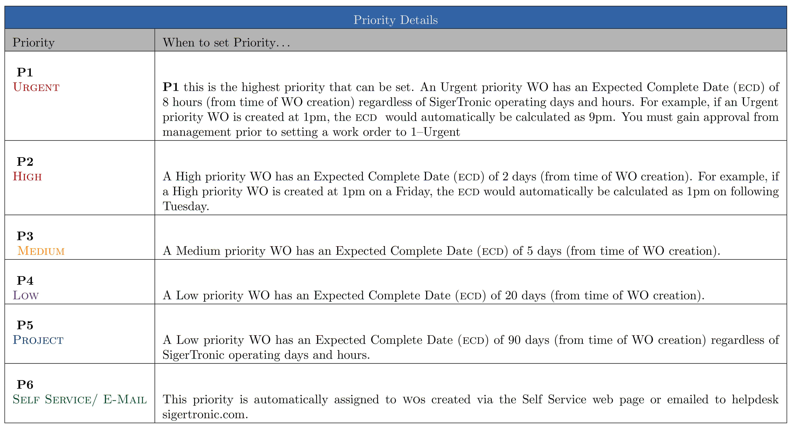

.. figure:: image/siger.jpg
   :height: 300px
   :width: 300px    
   :scale: 85 %
   :align: center

#####################################
T001-Work Order Workflow in Track-It!
#####################################
.. topic:: Overview

   :Date: |today|
   :Author: **Corbin Fletcher**

.. contents:: 
   :depth: 2

+------------+------------+-----------+------------+
| Document   | Release    | Author    | Version    |
| ID         | Date       |           |            |
+============+============+===========+============+
| T001-Work  | 24/09/2014 | Bobby     | v 1.0      |
| Order      |            | Bennett   |            |
| Workflow in|            |           |            |
| TrackIT!   |            |           |            |  
+------------+------------+-----------+------------+

.. versionadded::  v 1.0

*************
Introduction
*************
Steps and guidelines for the proper workflow of work orders using BMC TrackIT!. This SOP was written based on Track-It v11.3 but will likely remain unchanged despite newer versions of Track-It.

******************
Track-It Overview
******************

IT Help Desk
=============
This section give a brief overview of the initiative. Improve end-user satisfaction and resolution rates while reducing costs by allowing your help desk technicians to track their work more efficiently. Justify the need for additional staff through tracking of all tasks. Department Security can segment data so multiple departments can utilize the Track-It! Help Desk to manage their tasks. Facilities, Human Resources and IT Help Desk can all benefit from task management using Track-It! The Help Desk includes LDAP/Active Directory integration, Work Order Templates, Service Level Agreements (SLAs), Work Order Timer, Stop the Clock, Scheduled Work Orders, Scheduled Reports, Parent/Child tickets, Automatic Email to Work Order conversion, Skill Routing, Event Policies, Automatic Prioritization, Automatic Escalation, Email Conversation Management and Notifications.

Asset Management
================
Reduce costs and wasteful spending on IT assets you thought were lost or didn’t realize you owned. Automatic asset discovery and auditing gather and record asset information for everything on your network, giving you the ability to take control of your IT environment and make better decisions with complete hardware, software and configuration data about all of your assets. The Inventory module includes popular features such as Asset Discovery, Auditing, Audit on Demand, Unassigned
Equipment Inventory and Asset Retirement.

Self Service Portal
===================
Reduce costs by allowing end-users to log tickets and get status on existing tickets through the Self-Service Web Portal. Your users can submit new requests, search for solutions to common problems, view the status of previously submitted work orders, access their asset information or reset their AD password. You can even utilize the Active Directory integration to provide trusted AD authentication for rapid and easy access. Save time and precious resources by helping users to help themselves.

Software License Management
===========================
Never waste money on software licenses that you already owned or worry about fines or penalties related to a software audit. Along with the Track-It! Asset Management module, Software License Management helps you keep track of and report on the number (and type) of software licenses owned and utilized within your organization. Gain control over your software licensing costs and get access to instant and accurate license information.

Mobile Help Desk
================
Save time and money by allowing your mobile help desk technicians to update their work orders and enter new ones while on the go. The Track-It! Mobile capability gives technicians easy mobile access to the Help Desk, Asset Management and Knowledge Management modules. Technicians can now update or add work items from anywhere, allowing them to give great service to your users on the move and keep up with their work without having to go back to their desk.

Knowledge Management
====================
Save time and money by utilizing lessons learned from previous help desk tickets. Knowledge management in the Solutions module allows IT staff to build a database of solutions to help save time and money training new IT staff or troubleshooting known issues as well as allowing end users to resolve common issues themselves by giving them the ability to search known solutions in the self-service portal. Solutions can be marked as Public or Private, allowing you to filter which solutions are seen by your Help Desk Technicians and which are seen by your end-users.

Scheduled & Emailed Reports
===========================
Save time and money by optimizing your Help Desk and Asset Management operations by regularly monitoring key metrics. Schedule and e-mail reports automatically to keep you and your management up to date on the latest trends in your business. Based on the industry leading Crystal Reports reporting tool, you get the sophistication and flexibility you need to keep track of key performance and capacity data.

Dashboards & Analytics
======================
Reports and dashboards help you save time and money by giving you an instant and visual display of your key performance indicators. Schedule and email important reports for regular metrics reporting in your group or to management. Continually improve your service quality through effective and timely reporting.

Track-It Manuals and Training 
=============================
Manuals are located at SigerUniversity on the SigerTronic Systems Intranet::
`Siger Team Site <https://sigertronicsystems.sharepoint.com/SigerUniversity>`_ Training documents are stored by Track-It version.

*********
Workflow
*********

Processes
##########

#. Log into Track-It! HelpDesk with your user name;

#. Click **New Work Order** button this brings up a blank work order in a new window.

#. Click the **Requester** drop down menu, begin typing the customers, and choose the client from the list, or choose **Walk In**;

#. Populate the Phone number field with the Walk In customers correct phone number;

#. Set the appropriate **Priority**;

#. Click the **Type** drop down box and choose the correct type (e.g., software, labor, networking, etc.);

#. Click **Sub Type** and choose the correct sub type;

#. Next assign the work order to the correct Technician;

#. Next add the contact person’s name;

#. Populate the Summary filed with a short but accurate description of the work to be performed;

#. The **Note** field is where you added a detailed account of the services being requested. If the customer has delivered his/her laptop, the lap top’s charger, and laptop sleeve, you are required to list all these items in the Notes field. You must be detailed, specific, and complete when writing your note. While populating the Notes field you must provide sufficient detailed information and there is no room for vagueness or ambiguity in your description.

#. Click the **Add Note** button;

#. The second work order note is always the fact that our customer has paid the required $45.00. This is a second and separate note. This second note must also include Quickbooks invoice number. You are required to generate a Quickbooks invoice for the $45.00 the customer paid;

#. Before moving on to the next step *review your work carefully*;

#. Save and Close;

#. Next, re-open the Work order, and print two pages. One page is singed by the customer, and the second copy is singed by the SigerTronic Systems employee. Further, the copy of the work order, which was signed by the customer, is retained by SigerTronic Systems and the customer is provided with the copy that the SigerTronic employee singed. This creates a signed service agreement between SigerTronic Systems and our customer(s).

Scope
#####

All service that is requested by customers must have a work order created. This SOP provides employees, who are not familiar with the process, the information need to complete this task. 

.. seealso::
   For additional detailed information see **SOP T001-Work Order Work Flow in Track-it**.   

Responsible Personnel
#####################
Any team member who is responsible for invoicing customers could be required to seek payment on unpaid invoices. This process is primarily the responsibility of one of our sales floor team members. 

Required Fields
###############

+------------+----------------------------------------+
| Filed      | Description                            |
|            |                                        |
+============+========================================+
| Summary    | A brief one line summary of the issue  |
|            | or task. Enough information should be  |
|            | provided so that anyone looking at a   |
|            | list of issue will be able to have an  |
|            | idea as. to what the WO is about.      |
|            | Examples of bad summaries are          |
|            | “Printer Issue” or “Computer Problem”  |
|            | or “Check System”. Better summaries    |
|            | would be “HP OfficeJet 8600 not        |
|            | printing” or                           |
|            | “Dell Dimension 3100 booting issues”,  |
|            | or “Perform full system check and      |
|            | provide recommendation”.               | 
+------------+----------------------------------------+
| Priority   |                                        | 
|            | - 1 Urgent,                            | 
|            | - 2 High,                              |
|            | - 3 Medium,                            |
|            | - 4 Low,                               |
|            | - 5 Project,                           | 
|            | - 6 Self Service/Email                 |
|            +----------------------------------------+
|            | Note: You must gain approval from      |
|            | management prior to setting the        |
|            | priority to *1-Urgent*                 | 
+------------+----------------------------------------+
| Status     |  Status should be changed by           |
|            |  technicians                           | 
|            |  as the WO progresses. When a WO is    |
|            |  opened, the default is Open.          |
|            |  Other statuses are                    |
|            |                                        |  
|            |  - Canceled,                           |
|            |  - Closed,                             |
|            |  - Completed – To Be Invoiced,         | 
|            |  - In Progress, and                    |
|            |  - Job Completed.                      |
+------------+----------------------------------------+
| Type       | This is the type of issue or request,  |
|            | e.g. Hardware, Software, Network,      |
|            | Telecom, Quote, etc.                   |
+------------+----------------------------------------+
| Subtype    | Each type is broken down into subtypes.| 
|            | E.g. Hardware has subtypes such as     |
|            | Computer, Printer, Router, Keyboard,   |
|            | etc.                                   |
+------------+----------------------------------------+
| Contact    | Enter a Point Of Contact (POC). Be     |
| Person     | sure to include a phone number and     |
|            | email address if possible.             | 
+------------+----------------------------------------+ 

Definitions
###########
*Track-It!*:
    Is our IT help desk ticketing, customer service, issue tracking, system used by all SigerTronic Systems employees.
*Work Order*: 
    Is a start to finish record of the work to be performed.
*Technician*: 
    SigerTronic Systems employ’s computer repair technicians who are skilled professionals. When you are creating a work order you must assign the work ordered to the correct technician (see process #8, in section 1). 

Addational Information
######################
.. warning:: 
    This is an important section and it should not be over looked.  

* When receiving personal property from a client--for service by SigerTronic System—all components must be physically labeled prior to delivering the items to the technicians for service. Additionally, each item is articulated in the Notes section of the Work Order. If a customer delivers a laptop and the lap top charge for service, both items must be listed in the Notes section of the work order, then they are physically labeled, finally the items can be delivered to the technicians. Labels are provided to you for your use.    

* All walk in customers (requesting repairs or service) pay a $45.00 fee which is added to the work order as a second note. This fee is paid at the time they deliver their personal items for repair. The only customers who are exempt from the $45.00 fee are commercial clients who have open accounts with SigerTronic Systems. 

* This task requires our team member to generate a Quickbooks invoice (see procedure #13 for details). 

.. seealso::

   Additionally, you can obtain SOP **G002-Create an Invoice** for detailed information on how to create a Quickbooks invoice.

