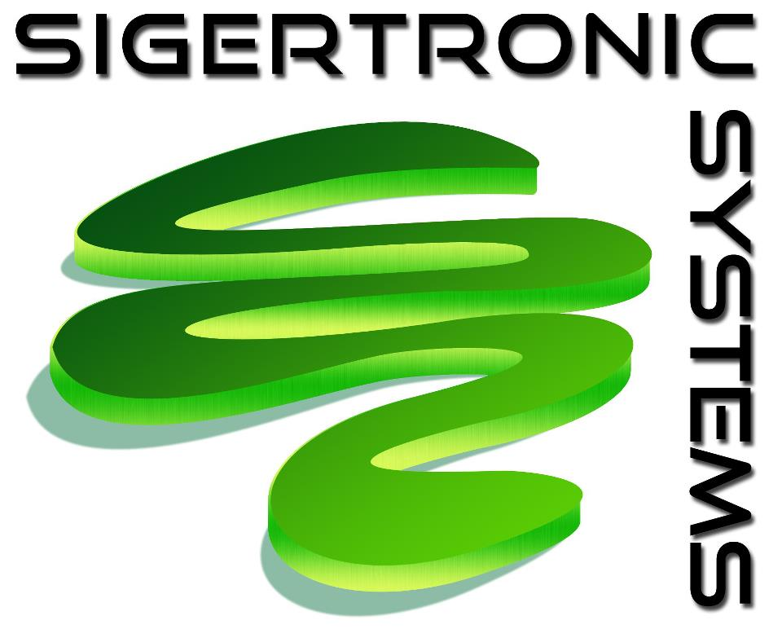

**************************************
G016--Collect Payment on Open Invoice
**************************************
.. topic:: Overview
 
   :Date: |today|
   :Author: **Corbin Fletcher**
   
.. contents:: 
   :depth: 2

.. cssclass:: table-bordered

+------------------------+------------+----------+----------+
| Ducument ID            | Release    | Author   | Version  |
|                        | Date       |          |          |
+========================+============+==========+==========+
| G016-Collect Payment   | 16/2/2015  | Corbin   | v 1.0    |
| on Open Invoice        |            | Fletcher |          |
+------------------------+------------+----------+----------+

.. versionadded:: 11/2/2015

.. versionchanged:: 1.0.1 Fundamental changes made to the structure of the document. 

.. note:: The above is an example of some version control that can be added to each SOP. 

.. todo::

   This is a test

Introduction
############
This SOP will provide details needed for any team member to query our Quickbooks database and use an open invoice report to inquire with each customer who has an unpaid invoice. In some situations we will provide customers thirty day terms to satisfy their invoice; however, if thirty days passes, and we have not yet received payment, we will begin calling customers and requesting payment in full. 

Procsses
#########
#. From the **QuickBooks Reports** menu, select **Customers & Receivables**, and then **Open Invoices**, Run open invoice report. The report is sorted alphabetically by customer name; 

#. Check the **aging column**. If the aging column has digit present you will need to call the customer and request they send payment as soon as possible.

#. Document your findings from each phone call inquiry with our customers and submit your finding to management.   

.. topic:: SOPs and Their Functions

   An SOP is *not* intended to answer all question a team member may have about the business process. In contrast, SOPs are intended to be a supplemental training tool which enhances other training.    

Responsible Personnel
#####################
Any team member who is responsible for invoicing customers could be required to seek payment on unpaid invoices. This process is primarily the responsibility of one of our sales floor team members.

.. sidebar:: Team Members 
   
   Although you may not currently seek payment on open invoices, you may be asked to assist in this process, and this SOP will help you understand the steps need to complete this task.

Definitions
###########
*Open Invoice Report*: 
    Is a Quickbooks report that shows all unpaid invoices in our quickbooks database. 

*Aging Column*: 
    This column reflects a total number of days past thirty days that a customer has owed us money on an open invoice. So, if the aging column has a digit of three; this is three days past thirty days, or a total of thirty three days.                                      

Addational Information
######################
.. warning::

   This is an important section and it should not be over looked. 

* In some situations, we may provide a customer thirty day terms to pay an invoice; however, if thirty days has passed and we have not received payment we will call our customers and request payment. If requested you can provide the customer a copy of the invoice to facilitate payment.   

* During every work week you will need to call customers who have a digit in the aging column of the open invoice report. After each phone call you are required to document your findings and submit your document to management. 

    * An example of “documenting your findings”-- you could create a Microsoft Excel spread sheet and articulate the details (i.e., customer name, invoice number, etc. ) of each customer you call. Our primary concern is, when we can reasonably expect payment from the customer? And the payment status must be included in your documentation.   
.. topic:: 
   
   `Creative Commons Attribution-NonCommercial-ShareAlike 4.0 International License <http://creativecommons.org/licenses/by-nc-sa/4.0/>`_.

.. image:: image/CC.jpg

